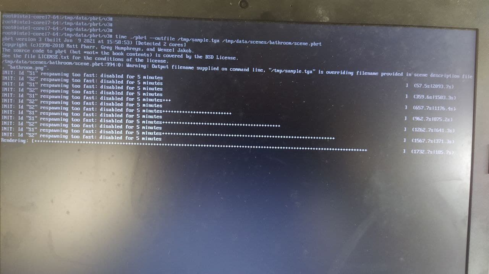

# Proyecto 3: Sistema operativo empotrado de propósito específico

El siguiente proyecto consiste en ejecutar la aplicación *(PBRT)* en distintos sistema operativo *(OS)*. y medir su desempeño, esto con el fin de realizar una comparación de un *OS* de uso general vs un *OS*. de aplicación específica.

### Detalles tecnicos

Equipo donde se realizan las pruebas es un *Notebook HP 240 G6 Intel® Celeron® N3060* el cual tiene las siguientes características


Cómo OS se tienen:
- Windows 10 21H1
- Ubuntu 20.04.2.0 LTS
- Yocto 3.1.7 LTS *

`*` OS de aplicación específica

La configuración de compilación de Yocto
```
Build Configuration:
BB_VERSION           = "1.46.0"
BUILD_SYS            = "x86_64-linux"
NATIVELSBSTRING      = "universal"
TARGET_SYS           = "x86_64-poky-linux"
MACHINE              = "intel-corei7-64"
DISTRO               = "poky"
DISTRO_VERSION       = "3.1.7"
TUNE_FEATURES        = "m64 corei7"
TARGET_FPU           = ""
meta                
meta-poky           
meta-yocto-bsp       = "dunfell:97039a5db60b328f94526d9a95de0c8ef4fc0d2e"
meta-intel           = "dunfell:2fb89eb85dea00de9446c1cf44ba6a5586f42c84"
```


En Windows 10 voy a usar [Windows Subsystem for Linux](https://docs.microsoft.com/en-us/windows/wsl/install-win10) *(WSL)*

Para que la comparación sea lo más justa posible la pc estan en modo *high performance* lo va dar luz verde para pasar la frecuencia base de la CPU y además se ha habilitado la virtualización.


Lo que nos dice Microsoft sobre WSL es que los ejecutables de Linux (en formato ELF) se van a ejecutar se forma nativa en Windows, y esto se puede observar a continuación


### Descargas

- [Imagen iso](https://mega.nz/file/kypgGK7Z#k-gd9lOzcFlBNAiVA2CFk37EzEf6V-KQ2nXH8Lk8e00)

- [Imagen docker pbrt/v3](https://mega.nz/file/R7JHVQSZ#GUCHGUBu048FYNV1Mwav1jFJqw4RyvrIRL9-gVTGIqQ)


### Escenas

Inicialmente estaba renderizando las escenas Barcelona Pavilion y Crown que tenían una duración considerable `~7200 s` sin embargo debido a algunos problemas que mi primer equipo de pruebas me vi obligado a cambiar a un pc con prestaciones muy pobres y ese tiempo se volvió exponencial, por esta razon decidi usar las escenas Bathroom y Staircase las cuales se pueden descargar [aquí](https://benedikt-bitterli.me/resources/).

**Bathroom**

{ width=50% }

**Staircase**

{ width=50% }

### Comparativa

Con Yocto tengo el problema de que no puedo hacer scroll y `pbrt` al finalizar me muestra estadísticas lo cual no me deja visualizar el tiempo total, para medir el tiempo usare `time`




#### Bathroom

Windows


Ubuntu


Yocto


Resumen


-------------------------

#### Staircase

Windows


Ubuntu


Yocto


Resumen


-------------------------


#### Bathroom

Ubuntu docker


Resumen


### Extras

Hace un tiempo aprendí docker y desde entonces lo he estado usando en varias cosas, `dockerfile` para crear una imagen con `pbrt/v3`

```dockerfile
FROM debian:stable-slim

ENV DEBIAN_FRONTEND noninteractive

RUN apt-get update && \
   apt-get upgrade -yq && \
   apt-get install -yq \
   wget git \
   build-essential \
   gcc \
   g++ \
   cmake \
   make \
   libpthread-stubs0-dev

RUN git clone --recursive https://github.com/mmp/pbrt-v3.git \
   /pbrt/v3/

RUN cd /pbrt/v3 && cmake . && make -j8

RUN apt-get clean && \
   apt-get autoclean && \
   apt-get autoremove
```


Script para hacer pruebas rápidas

```bash
#!/bin/bash

DIR="/tmp"
DIR_PBRT="$DIR/pbrt/v3"

SCENE1="barcelona-pavilion"
SCENE2="crown"

URL="https://gitlab.com/bo-jcube/pbrt-v3-scenes/-/archive/master/pbrt-v3-scenes-master.tar.bz2"


git clone --recursive https://github.com/mmp/pbrt-v3.git $DIR_PBRT
cd $DIR_PBRT && cmake . && make -j8

cd $DIR

curl -s "$URL?path=$SCENE1" | tar xjv -C $DIR
curl -s "$URL?path=$SCENE2" | tar xjv -C $DIR

echo ""
echo "$DIR_PBRT/pbrt --outfile $DIR/simple.tga $DIR/pbrt-v3-scenes-master-..."
echo ""
```


poky/build/conf/local.conf <<
```
CONF_VERSION = "1"

RM_OLD_IMAGE = "1"
INHERIT += "rm_work"

MACHINE = "intel-corei7-64"

IMAGE_FSTYPES = "live"

## driver ethernet

MACHINE_ESSENTIAL_EXTRA_RRECOMMENDS += "kernel-module-realtek kernel-module-r8169"

KERNEL_MODULE_AUTOLOAD += "realtek r8169"

## eliminar la pantalla de inicio
IMAGE_FEATURES_remove += "splash"

## instalar dependencias

IMAGE_INSTALL_append += " \
   packagegroup-core-buildessential \
   gcc g++ cmake make wget curl git \
   "

EXTRA_IMAGE_FEATURES = ""

## agregar usuarios

INHERIT += "extrausers"
EXTRA_USERS_PARAMS = " \
   useradd eos175; \
   usermod -p $(openssl passwd abc123) eos175; \
   usermod -p $(openssl passwd adminHW) root; \
   usermod -a -G sudo eos175; \
   "
```


### Referencia

https://docs.yoctoproject.org/index.html

https://www.yoctoproject.org/docs/latest/ref-manual/ref-manual.html

https://pbrt.org/scenes-v3

https://www.foobarflies.io/starting-with-yocto/


